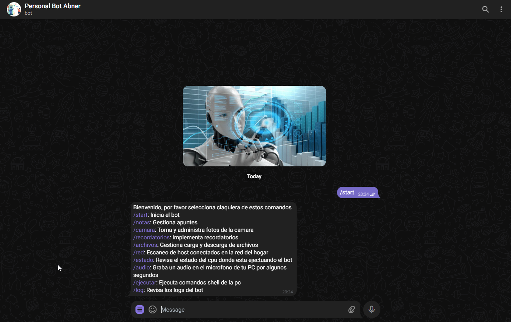
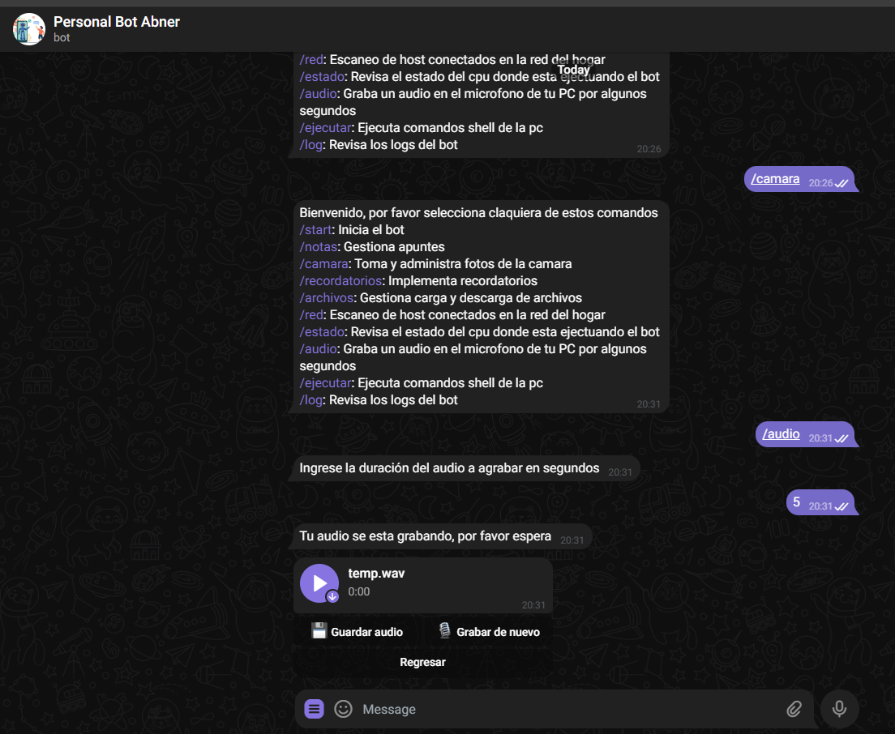
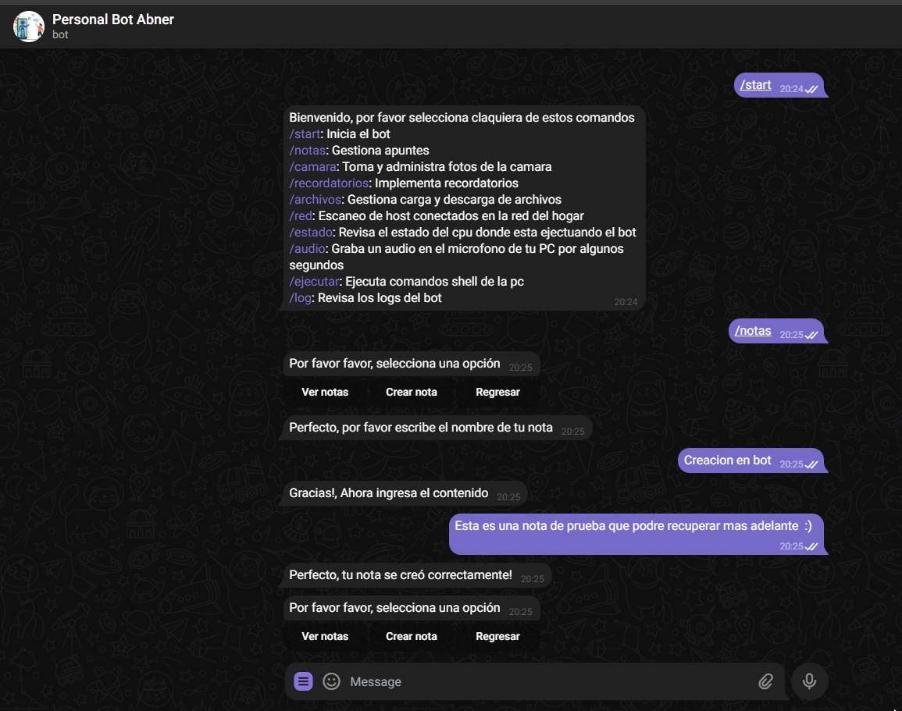
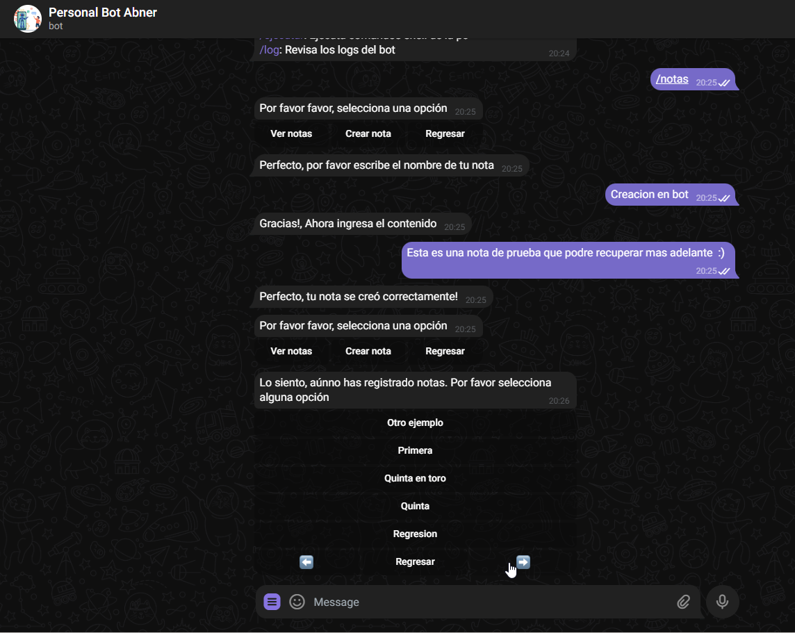
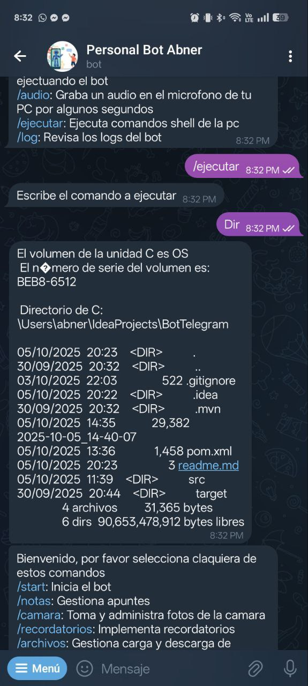
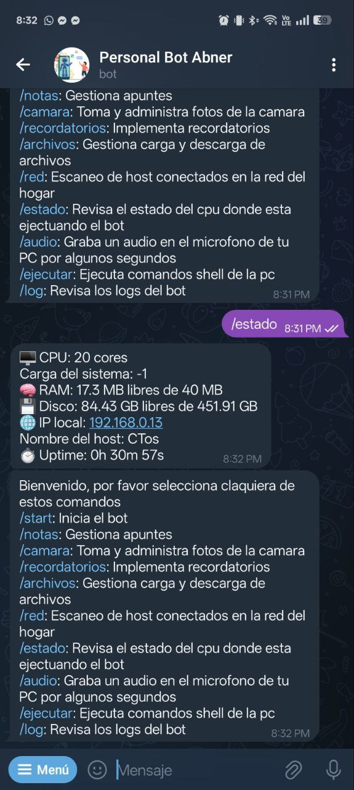
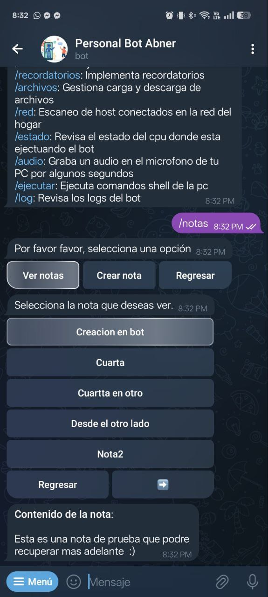

# 🧠 Bot de Telegram para Automatización Personal

Este proyecto es un bot de Telegram diseñado para interactuar con la PC de forma remota, automatizar tareas cotidianas y ofrecer herramientas útiles para productividad, monitoreo y control. Está construido en Java y pensado para crecer modularmente con nuevas funciones.


## Índice

- [Funcionalidades](#-funcionalidades-actuales)
- [Funcionalidades Futuras](#-funcionalidades-futuras)
- [Requisitos](#-depenedenicas-)
  - [Dependencias maven](#archivo-pom)
  - [Directorios](#directorio-raiz)
- [Instalación](#-instalación)
- [Capturas](#-capturas)
  - [Web](#web)
  - [Movile](#movile)
- [Estructura del proyecto](#-estructura-del-proyecto)
- [Seguridad](#-seguridad)
- [Autor](#-autor)

---

## 🚀 Funcionalidades actuales

- **Notas** – Gestiona apuntes personales directamente desde Telegram
- **Camara** – Toma y administra fotos usando la cámara conectada al sistema 
- **Red** – Escanea los hosts conectados en tu red local
- **Estado** – Muestra el estado del CPU, RAM y otros recursos del sistema
- **Audio** – Graba audio desde el micrófono por un tiempo determinado
- **Ejecutar** – Ejecuta comandos shell en tu PC y devuelve la salida
- **Log** – Revisa los logs generados por el bot para auditoría o depuración

---

## 🔃 Funcionalidades futuras

- **Archivos** – Manipular archivos del PC para intercambiar documentos
- **Recordatorios** – Guardar reordatorios y gestión de envio de mensajes
- **Correo** – Envio de correos mediante el correo personal
- **IA** - Integración con alguna api de IA como Gemini API o GPT

## 📦 Depenedenicas 

### Archivo POM
La instalación de este paquete usa la libreria de [Telegram Bot Java](https://github.com/rubenlagus/TelegramBots).
Tambien utiliza la libreria [Lombok](https://mvnrepository.com/artifact/org.projectlombok/lombok) para el mapeo
automatico de los Setters y Getters así como el paquete [Web Cam capture](https://github.com/sarxos/webcam-capture) de Sarxos para 
la toma de la fotografía en el comando /camara

```xml
<dependencies>
    <!-- Telegram Bots API -->
    <dependency>
        <groupId>org.telegram</groupId>
        <artifactId>telegrambots-longpolling</artifactId>
        <version>9.1.0</version>
    </dependency>
    <dependency>
        <groupId>org.telegram</groupId>
        <artifactId>telegrambots-client</artifactId>
        <version>9.1.0</version>
    </dependency>

    <!-- Lombok (para anotaciones como @Builder, @Getter, etc.) -->
    <dependency>
        <groupId>org.projectlombok</groupId>
        <artifactId>lombok</artifactId>
        <version>1.18.30</version>
        <scope>provided</scope>
    </dependency>

    <!-- Webcam Capture (para tomar fotos con la cámara) -->
    <dependency>
        <groupId>com.github.sarxos</groupId>
        <artifactId>webcam-capture</artifactId>
        <version>0.3.12</version>
    </dependency>
```
### Directorio Raiz

El bot utiliza la ruta ```C:\TeleBotAbner``` por defecto para colocar lo creado, es necesario
que se cree manualmente ya que por ahora en la versión inicial no se crean los directorios automaticos.
Las carpetas que deben existir son:

```
    ├── Images
    ├── Logs
    ├── Notes
    ├── Records
```


## 💻 Instalación

1. Clona el repositorio:
   ```bash
   git clone https://github.com/tu-usuario/tu-repo.git


## 📷 Capturas

El bot es el mismo para ambos, es decir, no hay codigo separado. Las capturas se tomaron de 
ambos lados para ver el diseño en los dos lugares, sin embargo las funciones son generales
al ser parte de Telegram y no directamente de un aplicativo.

### Web





### Movile





## 🧠 Estructura del proyecto

```
src/ 
    ├── bot/ ← lógica principal del bot 
    ├── command/ ← comandos individuales como notas, cámara, etc. 
    ├── utilities/ ← funciones auxiliares y constantes 
    ├── commandTexts/ ← textos y respuestas por comando
```

## 🔐 Seguridad

Este bot accede a tu sistema local (archivos, cámara, micrófono). Se recomienda:

- Usar en entornos controlados
- No compartir el token públicamente
- Agregar autenticación para comandos críticos como `ejecutar`
- Agregar un sistema de contraseña de acceso (Mejora planeada)


## 🧑‍💻 Autor

Desarrollado por Abner Ramírez  
📍 Guatemala  
💬 Contacto: [Gmail](abnerraoficial@gmail.com)
